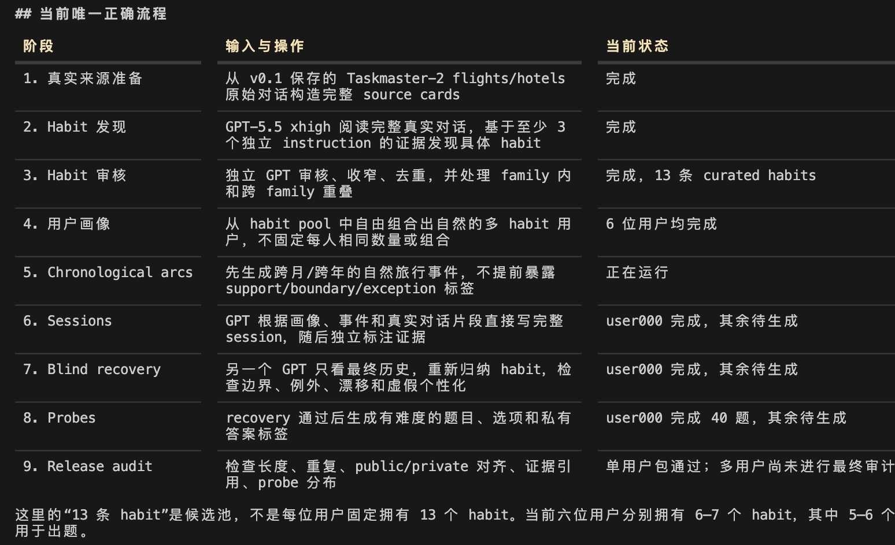
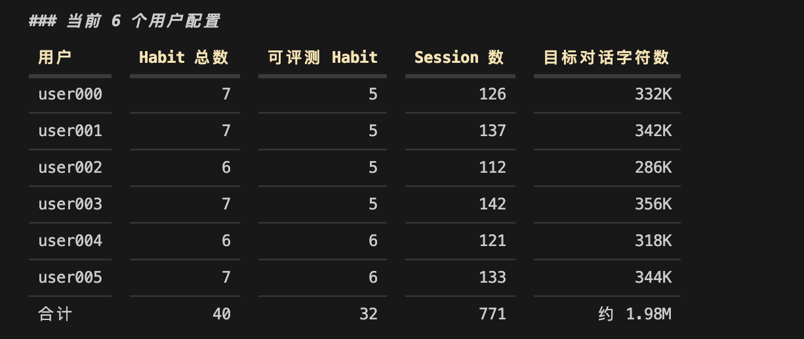

当前流程：

（1）、当前 6 个用户配置：

   
  这里要区分：
- Habit 总数：用户画像中实际存在的习惯，包括背景习惯。
- 可评测 Habit：有足够跨时间证据、能够合理生成 probe 的习惯。
- 背景 habit 不强行出题，主要用于增加用户真实性、上下文干扰和习惯之间的组合关系。
  
  因此目前是：
  
- 每个用户 6–7 个 habit；
- 其中 5–6 个用于正式评测；
- 不是每个用户机械地绑定完全相同数量和类型的 habit。
  
（2）Session 设置

  每个用户大约 112–142 个 session，总体目标是让完整历史无法直接塞入单次 Qwen3-8B 的评测上下文。
  当前要求包括：
- 完整用户历史至少达到本地 Qwen3-8B tokenizer 的 51,200 tokens；
- 这是 Qwen 上下文设置 40,960 tokens 的 1.25 倍；
- session 按真实事件需要自然变化，不固定成统一长度。
  
[图片]
  类型不是按固定比例硬分配，而是由旅行事件决定。例如简单确认可能是 micro，跨航班、酒店和同行人协调则可能是 long。
  
（3）Habit 成为可评测目标的条件：

  一个 habit 不是写进用户画像就直接出题，至少需要：

- 出现在 3 个不同 episode 中；
- 覆盖 early/middle/late 中至少两个阶段；
- 第一条和最后一条证据的跨度至少覆盖用户历史的三分之一；
- 至少有两个明确支持该 habit 的 episode；
- probe 引用至少 3 个不同 session，且来自至少 3 个 episode。
  如果存在边界、例外或者偏好修订，还可以生成对应的高难度 probe；如果数据里没有真实出现，就不会机械补造。
（4）Probe 数量：
  已经冻结的 user000 当前是：
- 5 个可评测 habit；
- 每个 habit 6 道正向 probe，共 30 道（历史中确实存在某个 habit，测试模型能不能正确使用它）；
- 另外 10 道 false-personalization probe（历史中没有足够证据支持某个 habit，测试模型会不会胡乱推断用户偏好）；
- 合计 40 道 probe。
  
  这 40 道的类型分布包括：
  
- boundary：6
- conflict resolution：6
- cross-context transfer：7
- evidence disambiguation：7
- exception：3
- direct use：1
- false personalization：10
  
  其他 5 个用户的 probe 尚未全部生成，当前代码没有强制“每个用户必须恰好 40 道”，而是按照证据质量决定：
  
- 每个可评测 habit 最少保留 4 道；
- 最多保留 8 道；
- 5 个可评测 habit：理论上 20–40 道正向 probe；
- 6 个可评测 habit：理论上 24–48 道正向 probe；
- 最终还需要加入 false-personalization 控制题。
  
  所以，user000 的 40 道是目前冻结版本的实际数量，但不是多用户生成器机械固定的数量。
  
（5）Probe 难度控制：

  所有 probe 都是四选一，并经过两类独立审核：
1. 只看题目、不看历史
要求模型无法仅靠常识稳定选中答案，至少两个选项表面上合理。
2. 查看完整证据
要求答案唯一、gold 正确、干扰项足够接近，并且难度达到 medium 或 hard。
  probe 会覆盖：
- 习惯直接应用；
- 跨场景迁移；
- 相似习惯之间的证据消歧；
- 条件边界；
- 冲突偏好的取舍；
- 例外保留；
- 习惯漂移/修订；
- 不应进行个性化的 false-personalization。
2、样例

 
 ## 1. Question

  > Maya needs Atlanta-Toronto flights for a partner review. She must arrive Monday before a 2 p.m. prep session.
  > The Thursday debrief is expected to end around 10:30 a.m. downtown, so the return should leave a reasonable
  > cushion while still getting her home the same day. All listed fares are within policy and avoid checked bags.
  > Which ticketing approach should be recommended?

  ## 2. Choices

  A.

  Delta round trip: ATL to YYZ nonstop 9:05 a.m. to 11:15 a.m. Monday; YYZ to ATL nonstop 12:35 p.m. to 2:55
  p.m. Thursday; $612.

  B.

 Air Canada round trip: ATL to YYZ nonstop 9:45 a.m. to 11:55 a.m. Monday; YYZ to ATL nonstop 3:15 p.m. to
 5:35 p.m. Thursday; $620.

  C.

  Delta outbound plus Air Canada return on one agency ticket: ATL to YYZ nonstop 9:05 a.m. to 11:15 a.m.
  Monday; YYZ to ATL nonstop 3:15 p.m. to 5:35 p.m. Thursday; $638.

  D.
  United round trip via Chicago: leaves Atlanta 7:25 a.m. Monday, arrives Toronto 1:20 p.m.; returns Thursday
  at 4:00 p.m.; $548.

  ## 3. Correct answer

  {
    "gold_choice_id": "C",
    "gold_action": "Recommend the mixed-carrier ticket that uses the suitable Delta outbound and a better-timed
    non-Delta return."
  }

  ## 4. Target habit

  {
    "name": "soft_delta_preferred_carrier",
    "family": "flight_airline_preference",
    "preference_value": "Delta is a preferred airline to include in the flight shortlist, but not an exclusive
    carrier requirement.",
    "condition": "When choosing among flight carriers and Delta is available while also satisfying the trip's
    schedule, route, price, and stop constraints.",
    "default_action": "Search for or present Delta options as part of the preferred carrier set, and favor Delta
    when it is otherwise comparable to alternatives.",
    "boundary_condition": "This is a soft preference: Delta is favored only among otherwise suitable options and
    may coexist with other acceptable preferred carriers.",
    "exception_condition": "Use another acceptable carrier when Delta is unavailable, materially worse, or does
    not meet the current trip constraints."
  }

  它不是“永远选 Delta”，而是：

  Delta 适合当前行程时优先考虑；
  Delta 明显违反时间、路线或价格约束时允许使用其他航空公司。

  ## 5. Longitudinal evidence

  ### Evidence 1：Session 0

  完整源对话：

  runs_wxq/taskmaster_planning_defaults_v0_4/release_single_user_pilot/private/sessions_with_annotations.jsonl:1

  时间和 episode：

  session_index: 0
  timestamp: 2024-01-08
  episode: Minneapolis client implementation
  signal_type: support
  confidence: 0.99

  精确用户原话：

  > “From ATL, Delta is nice if comparable, but I’m fine with another carrier.”

  ### Evidence 2：Session 39

  完整源对话：

  runs_wxq/taskmaster_planning_defaults_v0_4/release_single_user_pilot/private/sessions_with_annotations.jsonl:40

  session_index: 39
  timestamp: 2024-09-22
  episode: Chicago analytics training
  signal_type: support
  confidence: 0.99

  精确用户原话：

  > “Keep Delta in the mix if the times are reasonable, but not if it creates a weird day.”

  ### Evidence 3：Session 44

  完整源对话：

  runs_wxq/taskmaster_planning_defaults_v0_4/release_single_user_pilot/private/sessions_with_annotations.jsonl:45

  session_index: 44
  timestamp: 2024-10-17
  episode: Denver client configuration workshop
  signal_type: boundary
  confidence: 0.94

  精确用户原话：

  > “I can do Delta if it lines up, but nonstop and sane timing matter more.”

  ### Evidence 4：Session 52

  完整源对话：

  runs_wxq/taskmaster_planning_defaults_v0_4/release_single_user_pilot/private/sessions_with_annotations.jsonl:53

  session_index: 52
  timestamp: 2024-12-24
  episode: Philadelphia client kickoff
  signal_type: support
  confidence: 0.93

  精确用户原话：

  > “If Delta has a decent nonstop, I’d rather not land after 9 p.m. just to save a little.”

  ## 6. 为什么答案是 C

  当前行程中：

  - A 保留了 Delta，但 12:35 p.m. 的返程距离 10:30 a.m. downtown debrief 太紧。
  - B 的往返时间合理且更便宜，但完全没有利用用户的 Delta 软去程突时使用 Air Canada。
  - D 去险过高。

  所以 C 同时满足：

  保留 Delta 软偏好
  +
  不把航空公司偏好凌驾于具体时间约束
  +
  正确处理 trip-specific exception

  私有标签原始解释：

  > “The evidence shows Delta should be favored when it fits, but not forced when it creates an awkward day. The
  > outbound Delta flight is suitable and comparable; the all-Delta return is too tight after the debrief. A
  > mixed ticket preserves the preference where it works and treats the return as a trip-specific exception.”

  ## 7. Query-only 难度检查

  独立 query-only judge 的结果：

  {
    "answerable_without_history": false,
    "choice_id": "UNRESOLVED",
    "generic_best_exists": false,
    "plausible_choice_ids": ["B", "C"]
  }

  不看历史时：

  - B 更便宜、同样是合理的 nonstop 往返；
  - C 周一早到 40 分钟，但贵 $18；
  - 当前 query 没有提供航空公司偏好作为 tie-breaker。

  因此必须读取长期历史，才能在 B 和 C 之间选择 C。

  ## 8. Habit 的真实数据来源

  这个 habit 最初不是凭空写的，而是 GPT-5.5 xhigh 从三个独立 Taskmaster instructions 中归纳：

  runs_wxq/taskmaster_planning_defaults_v0_4/private/curated_habit_pool.jsonl:1

  原始 Taskmaster 证据：

  instruction_id: flight-6
  conversation_id: dlg-9728d808-4a19-4e73-83d6-31a095819bbf
  quote: “I do prefer Delta, if you can find it.”

  instruction_id: flight-8
  conversation_id: dlg-e6d3cc0c-97b2-4505-90fd-cf05ac79a51c
  quote: “I also would prefer to either take Southwest, JetBlue, United, or Delta.”

  instruction_id: flight-7
  conversation_id: dlg-b7377723-1b87-4a92-8f3c-f05ec010ae4f
  quote: “Let's stick with either Delta or American.”

  三条来源属于不同 conversation 和 instruction。它们只用于 grounding 一个“Delta 是软偏好”的 synthetic habit，不被
  伪装成同一个真实用户的纵向历史。